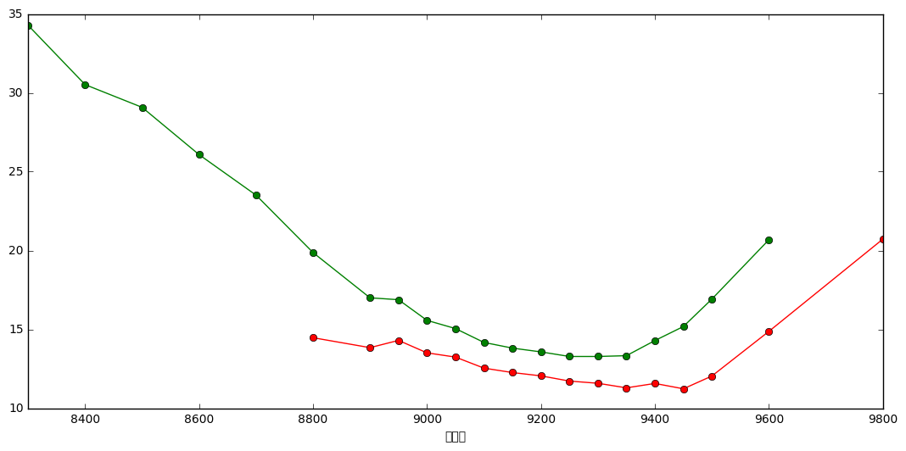
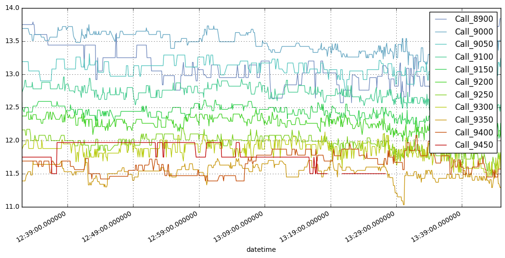
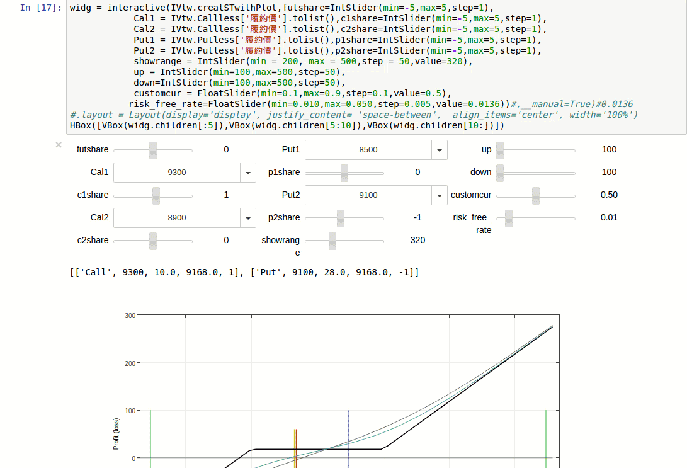

## IVtws 台灣期貨交易所報價爬蟲即時波動率計算與視覺化

- 資料來源 [台灣期貨交易所報價](http://info512.taifex.com.tw/)

## Requires
- python 2.7 or 3.x
- pandas >= 0.18
- numpy
- matplotlib
- selenium and PhantomJS
- requests
- plotly >= 1.9 (optional)
- ipywidgets (optional)
- bqplot (optional)
- colour (optional)


## Quick start example

```cmd
git clone https://github.com/Yvictor/IVtws.git
cd IVtws
jupyter Notebook
```
### using jupyter notebook
```python
from IVtws import IVstream
form IPython.display import display
import matplotlib.pyplot as plt
```

### import plotly offline to build interactivate plot


```python
#with plotly interactive plot
from plotly.tools import mpl_to_plotly
from plotly.offline import iplot,iplot_mpl,init_notebook_mode
init_notebook_mode()
```


```python
%matplotlib inline
```

### Initialize the IV table


```python
IVtw = IVstream((8,45),(13,45))
IVtw.init_table()
```

### update data and recalculate the Implied Volitity


```python
IVtw.append_IV()
```


<div>
<table border="1" class="dataframe">
  <thead>
    <tr style="text-align: right;">
      <th></th>
      <th>買進</th>
      <th>賣出</th>
      <th>成交</th>
      <th>成交價</th>
      <th>漲跌</th>
      <th>內含價值</th>
      <th>時間價值</th>
      <th>隱含波動率</th>
      <th>組合價</th>
      <th>總量</th>
      <th>時間</th>
      <th>TCUL</th>
      <th>履約價</th>
    </tr>
  </thead>
  <tbody>
    <tr>
      <th>15</th>
      <td>270.000</td>
      <td>272.000</td>
      <td>272.000</td>
      <td>272.0</td>
      <td>-37.000</td>
      <td>268.3</td>
      <td>3.7</td>
      <td>13.84</td>
      <td>9168.3</td>
      <td>300</td>
      <td>2016-10-14 13:44:29</td>
      <td>3.001722</td>
      <td>8900</td>
    </tr>
    <tr>
      <th>17</th>
      <td>178.000</td>
      <td>179.000</td>
      <td>178.000</td>
      <td>178.0</td>
      <td>-34.000</td>
      <td>167.5</td>
      <td>10.5</td>
      <td>13.51</td>
      <td>9167.5</td>
      <td>988</td>
      <td>2016-10-14 13:44:36</td>
      <td>3.001333</td>
      <td>9000</td>
    </tr>
    <tr>
      <th>18</th>
      <td>134.000</td>
      <td>136.000</td>
      <td>135.000</td>
      <td>135.0</td>
      <td>-36.000</td>
      <td>117.0</td>
      <td>18.0</td>
      <td>13.24</td>
      <td>9167.0</td>
      <td>1142</td>
      <td>2016-10-14 13:44:51</td>
      <td>3.000500</td>
      <td>9050</td>
    </tr>
    <tr>
      <th>19</th>
      <td>95.000</td>
      <td>96.000</td>
      <td>96.000</td>
      <td>96.0</td>
      <td>-34.000</td>
      <td>68.0</td>
      <td>28.0</td>
      <td>12.54</td>
      <td>9168.0</td>
      <td>8657</td>
      <td>2016-10-14 13:44:52</td>
      <td>3.000444</td>
      <td>9100</td>
    </tr>
    <tr>
      <th>20</th>
      <td>62.000</td>
      <td>63.000</td>
      <td>63.000</td>
      <td>63.0</td>
      <td>-33.000</td>
      <td>17.0</td>
      <td>46.0</td>
      <td>12.26</td>
      <td>9167.0</td>
      <td>16032</td>
      <td>2016-10-14 13:44:53</td>
      <td>3.000389</td>
      <td>9150</td>
    </tr>
    <tr>
      <th>21</th>
      <td>39.000</td>
      <td>39.500</td>
      <td>39.000</td>
      <td>39.0</td>
      <td>-26.000</td>
      <td>0.0</td>
      <td>39.0</td>
      <td>12.05</td>
      <td>9169.0</td>
      <td>49552</td>
      <td>2016-10-14 13:44:52</td>
      <td>3.000444</td>
      <td>9200</td>
    </tr>
    <tr>
      <th>22</th>
      <td>20.500</td>
      <td>21.000</td>
      <td>20.500</td>
      <td>20.5</td>
      <td>-20.500</td>
      <td>0.0</td>
      <td>20.5</td>
      <td>11.72</td>
      <td>9167.5</td>
      <td>47770</td>
      <td>2016-10-14 13:44:53</td>
      <td>3.000389</td>
      <td>9250</td>
    </tr>
    <tr>
      <th>23</th>
      <td>10.000</td>
      <td>10.500</td>
      <td>10.000</td>
      <td>10.0</td>
      <td>-13.000</td>
      <td>0.0</td>
      <td>10.0</td>
      <td>11.58</td>
      <td>9168.0</td>
      <td>43563</td>
      <td>2016-10-14 13:44:53</td>
      <td>3.000389</td>
      <td>9300</td>
    </tr>
    <tr>
      <th>24</th>
      <td>4.100</td>
      <td>4.200</td>
      <td>4.100</td>
      <td>4.1</td>
      <td>-7.400</td>
      <td>0.0</td>
      <td>4.1</td>
      <td>11.29</td>
      <td>9169.1</td>
      <td>21033</td>
      <td>2016-10-14 13:44:52</td>
      <td>3.000444</td>
      <td>9350</td>
    </tr>
    <tr>
      <th>25</th>
      <td>1.600</td>
      <td>1.700</td>
      <td>1.700</td>
      <td>1.7</td>
      <td>-2.800</td>
      <td>0.0</td>
      <td>1.7</td>
      <td>11.57</td>
      <td>9165.7</td>
      <td>21693</td>
      <td>2016-10-14 13:44:53</td>
      <td>3.000389</td>
      <td>9400</td>
    </tr>
  </tbody>
</table>
</div>


<div>
<table border="1" class="dataframe">
  <thead>
    <tr style="text-align: right;">
      <th></th>
      <th>履約價</th>
      <th>買進</th>
      <th>賣出</th>
      <th>成交價</th>
      <th>成交</th>
      <th>內含價值</th>
      <th>時間價值</th>
      <th>隱含波動率</th>
      <th>組合價</th>
      <th>漲跌</th>
      <th>總量</th>
      <th>TCUL</th>
      <th>時間</th>
    </tr>
  </thead>
  <tbody>
    <tr>
      <th>11</th>
      <td>8500</td>
      <td>0.500</td>
      <td>0.600</td>
      <td>0.6</td>
      <td>0.600</td>
      <td>0.0</td>
      <td>0.6</td>
      <td>29.08</td>
      <td>9189.4</td>
      <td>-0.300</td>
      <td>1926</td>
      <td>3.001111</td>
      <td>2016-10-14 13:44:40</td>
    </tr>
    <tr>
      <th>12</th>
      <td>8600</td>
      <td>0.800</td>
      <td>0.900</td>
      <td>0.8</td>
      <td>0.800</td>
      <td>0.0</td>
      <td>0.8</td>
      <td>26.08</td>
      <td>9189.2</td>
      <td>-0.400</td>
      <td>2605</td>
      <td>3.000778</td>
      <td>2016-10-14 13:44:46</td>
    </tr>
    <tr>
      <th>13</th>
      <td>8700</td>
      <td>1.300</td>
      <td>1.400</td>
      <td>1.4</td>
      <td>1.400</td>
      <td>0.0</td>
      <td>1.4</td>
      <td>23.51</td>
      <td>9181.6</td>
      <td>-0.800</td>
      <td>5801</td>
      <td>3.000944</td>
      <td>2016-10-14 13:44:43</td>
    </tr>
    <tr>
      <th>14</th>
      <td>8800</td>
      <td>2.100</td>
      <td>2.200</td>
      <td>2.1</td>
      <td>2.100</td>
      <td>0.0</td>
      <td>2.1</td>
      <td>19.87</td>
      <td>9167.9</td>
      <td>-0.900</td>
      <td>6778</td>
      <td>3.000389</td>
      <td>2016-10-14 13:44:53</td>
    </tr>
    <tr>
      <th>15</th>
      <td>8900</td>
      <td>3.700</td>
      <td>3.800</td>
      <td>3.7</td>
      <td>3.700</td>
      <td>0.0</td>
      <td>3.7</td>
      <td>17.00</td>
      <td>9168.3</td>
      <td>-1.400</td>
      <td>19534</td>
      <td>3.000389</td>
      <td>2016-10-14 13:44:53</td>
    </tr>
    <tr>
      <th>16</th>
      <td>8950</td>
      <td>6.000</td>
      <td>6.100</td>
      <td>6.0</td>
      <td>6.000</td>
      <td>0.0</td>
      <td>6.0</td>
      <td>16.88</td>
      <td>9182.0</td>
      <td>-2.400</td>
      <td>9207</td>
      <td>3.000722</td>
      <td>2016-10-14 13:44:47</td>
    </tr>
    <tr>
      <th>17</th>
      <td>9000</td>
      <td>10.000</td>
      <td>10.500</td>
      <td>10.5</td>
      <td>10.500</td>
      <td>0.0</td>
      <td>10.5</td>
      <td>15.57</td>
      <td>9167.5</td>
      <td>-3.000</td>
      <td>21161</td>
      <td>3.000389</td>
      <td>2016-10-14 13:44:53</td>
    </tr>
    <tr>
      <th>18</th>
      <td>9050</td>
      <td>17.500</td>
      <td>18.000</td>
      <td>18.0</td>
      <td>18.000</td>
      <td>0.0</td>
      <td>18.0</td>
      <td>15.05</td>
      <td>9167.0</td>
      <td>-2.000</td>
      <td>18981</td>
      <td>3.000444</td>
      <td>2016-10-14 13:44:52</td>
    </tr>
    <tr>
      <th>19</th>
      <td>9100</td>
      <td>27.500</td>
      <td>28.000</td>
      <td>28.0</td>
      <td>28.000</td>
      <td>0.0</td>
      <td>28.0</td>
      <td>14.17</td>
      <td>9168.0</td>
      <td>-1.000</td>
      <td>40078</td>
      <td>3.000444</td>
      <td>2016-10-14 13:44:52</td>
    </tr>
    <tr>
      <th>20</th>
      <td>9150</td>
      <td>45.500</td>
      <td>46.000</td>
      <td>46.0</td>
      <td>46.000</td>
      <td>0.0</td>
      <td>46.0</td>
      <td>13.81</td>
      <td>9167.0</td>
      <td>2.500</td>
      <td>37940</td>
      <td>3.000444</td>
      <td>2016-10-14 13:44:52</td>
    </tr>
    <tr>
      <th>21</th>
      <td>9200</td>
      <td>70.000</td>
      <td>71.000</td>
      <td>70.0</td>
      <td>70.000</td>
      <td>31.0</td>
      <td>39.0</td>
      <td>13.57</td>
      <td>9169.0</td>
      <td>7.000</td>
      <td>36969</td>
      <td>3.000389</td>
      <td>2016-10-14 13:44:53</td>
    </tr>
    <tr>
      <th>22</th>
      <td>9250</td>
      <td>103.000</td>
      <td>104.000</td>
      <td>103.0</td>
      <td>103.000</td>
      <td>82.5</td>
      <td>20.5</td>
      <td>13.28</td>
      <td>9167.5</td>
      <td>13.000</td>
      <td>12599</td>
      <td>3.000500</td>
      <td>2016-10-14 13:44:51</td>
    </tr>
    <tr>
      <th>23</th>
      <td>9300</td>
      <td>141.000</td>
      <td>142.000</td>
      <td>142.0</td>
      <td>142.000</td>
      <td>132.0</td>
      <td>10.0</td>
      <td>13.28</td>
      <td>9168.0</td>
      <td>21.000</td>
      <td>7654</td>
      <td>3.000611</td>
      <td>2016-10-14 13:44:49</td>
    </tr>
    <tr>
      <th>24</th>
      <td>9350</td>
      <td>181.000</td>
      <td>188.000</td>
      <td>185.0</td>
      <td>185.000</td>
      <td>180.9</td>
      <td>4.1</td>
      <td>13.33</td>
      <td>9169.1</td>
      <td>24.000</td>
      <td>1206</td>
      <td>3.000389</td>
      <td>2016-10-14 13:44:53</td>
    </tr>
    <tr>
      <th>25</th>
      <td>9400</td>
      <td>232.000</td>
      <td>239.000</td>
      <td>236.0</td>
      <td>236.000</td>
      <td>234.3</td>
      <td>1.7</td>
      <td>14.29</td>
      <td>9165.7</td>
      <td>36.000</td>
      <td>668</td>
      <td>3.001722</td>
      <td>2016-10-14 13:44:29</td>
    </tr>
  </tbody>
</table>
</div>


### quick plot with matplotlib inline


```python
fig,ax = plt.subplots(1)
Call = IVtw.Call[IVtw.Call['內含價值']<450].set_index('履約價',drop=False)
Put = IVtw.Put[IVtw.Put['內含價值']<450].set_index('履約價',drop=False)
Call['隱含波動率'].plot(ax = ax,figsize=(13,6),c='r',label='CallIV',marker='o')
Put['隱含波動率'].plot(ax = ax,figsize=(13,6),c='g',label='PutIV',marker='o')
```





### interactive visualization with plotly


```python
fig,ax = plt.subplots(1)
Call = IVtw.Call[IVtw.Call['內含價值']<500].set_index('履約價',drop=False)
Put = IVtw.Put[IVtw.Put['內含價值']<500].set_index('履約價',drop=False)
Call['隱含波動率'].plot(ax = ax,figsize=(13,6),c='r',label='CallIV')#,marker='o')
Put['隱含波動率'].plot(ax = ax,figsize=(13,6),c='g',label='PutIV')#,marker='o')
Call.plot.scatter(ax = ax, x='履約價',y='隱含波動率',s = Call['時間價值']*5,c=(0.7,0.3,0.3),edgecolor=(0.7,0.3,0.3))
Put.plot.scatter(ax = ax, x='履約價',y='隱含波動率',s = Put['時間價值']*5,c=(0.3,0.7,0.3),edgecolor=(0.3,0.7,0.3))
Call.plot.scatter(ax = ax, x='履約價',y='隱含波動率',s = Call['內含價值'],c=(0.7,0.7,0.9),edgecolor=(0.7,0.3,0.3))
Put.plot.scatter(ax = ax, x='履約價',y='隱含波動率',s = Put['內含價值'],c=(0.7,0.7,0.9),edgecolor=(0.3,0.7,0.3))
plotly_fig = mpl_to_plotly(fig)
plotly_fig['layout']['showlegend'] = True
iplot(plotly_fig)
```


### Plot IV as timeseries


```python
from colour import Color
```


```python
IVtw.CallIVtable.drop_duplicates().plot(figsize=(13,6),grid=True,
                                      color=[i.hex for i in list(Color(rgb=(0.45,0.55,0.75)).range_to(Color(rgb=(0.75,0,0)), len(IVtw.CallIVtable.columns.tolist())))])
```





```python
IVtw.PutIVtable.drop_duplicates().plot(figsize=(13,6),grid=True,
                                      color=[i.hex for i in list(Color(rgb=(0.45,0.55,0.75)).range_to(Color(rgb=(0.75,0,0)), len(IVtw.PutIVtable.columns.tolist())))])
```


### Plot Option curve with ipywidgets


```python
from ipywidgets import interactive,IntSlider,FloatSlider,Dropdown,Button,fixed,HBox,VBox,Layout
```


```python
widg = interactive(IVtw.creatSTwithPlot,futshare=IntSlider(min=-5,max=5,step=1),
            Cal1 = IVtw.Callless['履約價'].tolist(),c1share=IntSlider(min=-5,max=5,step=1),
            Cal2 = IVtw.Callless['履約價'].tolist(),c2share=IntSlider(min=-5,max=5,step=1),
            Put1 = IVtw.Putless['履約價'].tolist(),p1share=IntSlider(min=-5,max=5,step=1),
            Put2 = IVtw.Putless['履約價'].tolist(),p2share=IntSlider(min=-5,max=5,step=1),
            showrange = IntSlider(min = 200, max = 500,step = 50,value=320),
            up = IntSlider(min=100,max=500,step=50),
            down=IntSlider(min=100,max=500,step=50),
            customcur = FloatSlider(min=0.1,max=0.9,step=0.1,value=0.5),
           risk_free_rate=FloatSlider(min=0.010,max=0.050,step=0.005,value=0.0136))#,__manual=True)#0.0136
#.layout = Layout(display='display', justify_content= 'space-between',  align_items='center', width='100%')
HBox([VBox(widg.children[:5]),VBox(widg.children[5:10]),VBox(widg.children[10:])])
```

    [['Call', 9400, 1.7, 9165.7000000000007, 1], ['Put', 9050, 18.0, 9167.0, -1]]




```python
IVtw.close_PhantomJS()
```


```python

```
